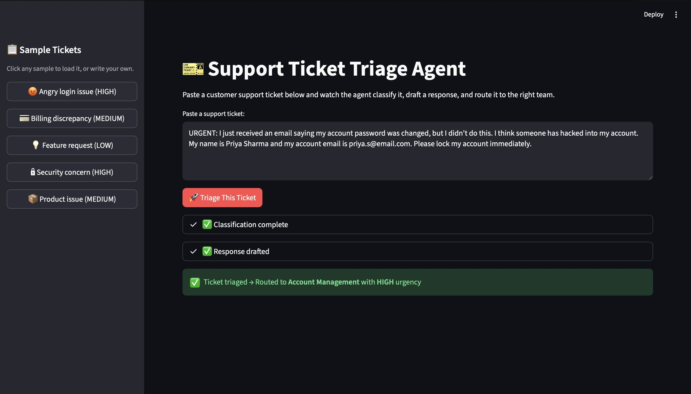

# 🎫 Support Ticket Triage Agent

An AI-powered agent that automates customer support ticket handling end-to-end. Paste a raw ticket → the agent classifies it, extracts key entities, drafts a customer response, and routes it to the correct team.

Built with Python, Groq (Llama 3.3 70B), and Streamlit.

## What It Does

The agent runs a two-step pipeline on every ticket:

**Step 1 — Classification:** Analyzes the ticket and returns structured JSON with:
- **Category** (billing / technical / account / product / general)
- **Urgency** (high / medium / low)
- **Customer name** (extracted or null)
- **Issue summary** (one sentence)
- **Routing** (which team should handle this)

**Step 2 — Response Drafting:** Generates a context-aware reply that:
- Addresses the customer by name if known
- Matches tone to urgency (urgent → immediate action, low → warm and appreciative)
- Provides specific next steps and timelines

## Demo



## Architecture

The agent follows a sequential two-step pipeline:

**1. Classifier (temperature = 0.1)**
- Input: Raw ticket text
- LLM call with structured JSON output
- Output: category, urgency, customer name, issue summary, routing destination

**2. Response Drafter (temperature = 0.4)**
- Input: Original ticket + classification data from Step 1
- LLM call with classification context
- Output: Personalised customer reply matched to urgency level

**3. Router**
- Routes ticket to the correct team based on category
- Flags urgency level for prioritisation

## Design Decisions

- **Model-agnostic architecture:** Uses Groq (Llama 3.3 70B) for fast, free inference during development. Swapping to Claude or GPT-4 is a one-line config change.
- **Structured JSON output:** The classifier returns JSON, not free text, because downstream systems (routing, dashboards, alerts) need parseable data.
- **Two different temperatures:** Classification uses 0.1 (consistency matters — same ticket should always get the same category). Response drafting uses 0.4 (slightly more natural language).
- **Human-in-the-loop:** The agent drafts responses but doesn't send them. A human reviewer approves before anything goes to the customer.

## Setup

```bash
# Clone the repo
git clone https://github.com/muhammad4k/support-ticket-triage-agent.git
cd support-ticket-triage-agent

# Create virtual environment
python3 -m venv venv
source venv/bin/activate

# Install dependencies
pip install -r requirements.txt

# Add your Groq API key
echo "GROQ_API_KEY=your-key-here" > .env

# Run the app
streamlit run app.py
```

## Project Structure

| File | Purpose |
|------|---------|
| `app.py` | Streamlit UI — the demo interface |
| `agent.py` | Core agent loop (classify → draft → route) |
| `classifier.py` | Standalone classifier with test cases |
| `hello_groq.py` | API connection test |
| `requirements.txt` | Python dependencies |
| `.env` | API key (not committed) |

## What I Would Build Next

- **Retry logic:** If JSON parsing fails, retry with a more explicit prompt
- **Confidence scores:** Have the LLM rate its own confidence on classification
- **Ticket history:** Store triaged tickets in a database for analytics
- **Multi-language support:** Detect ticket language and respond accordingly
- **Slack/email integration:** Route tickets directly into team channels

## Tech Stack

- **Python 3.10+**
- **Groq API** (Llama 3.3 70B) — LLM inference
- **Streamlit** — Demo UI
- **python-dotenv** — Environment variable management
